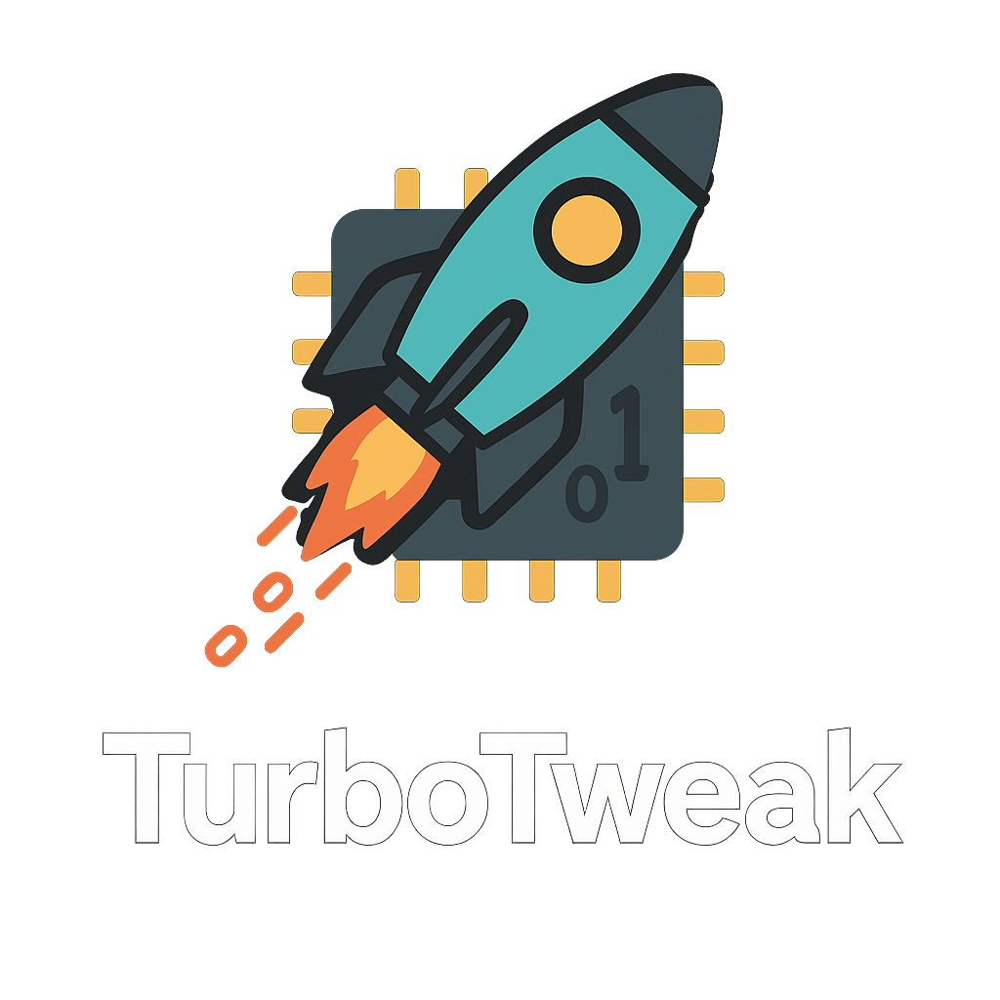

# TurboTweak

 <!-- Upload your custom logo.png to the repo root and replace this line -->

A modular set of PowerShell scripts for applying and removing advanced Windows 11 registry tweaks tailored for power users. These scripts enhance system performance, usability, and customization while prioritizing safety with backups, error handling, and confirmation prompts.

## Features
- **Modular Tweaks**: Individual scripts for specific changes, including:
  - Add/Remove "Take Ownership" context menu for files, folders, and drives.
  - Restore "Recent Places" folder in Explorer.
  - Enable/Disable verbose boot messages.
  - Apply/Remove performance optimizations (e.g., reduced startup delays, improved responsiveness).
  - Enable/Disable automatic registry backups.
- **Menu-Driven Interface**: Easy selection via TurboTweakMenu.ps1 for applying or removing tweaks singly or all at once.
- **Safety Measures**:
  - Automatic registry backups to OneDrive or Documents folder.
  - Elevation checks and UAC prompts where needed.
  - Error handling with logging (TurboTweak.log).
  - Optional Explorer restart for immediate application.
- **Reversibility**: Dedicated removal scripts to restore defaults.
- **Portability**: Relative paths ensure functionality when folder is moved.

## Requirements
- Windows 11 (tested on 22H2+ builds).
- PowerShell 7+ (pwsh.exe) for modern features; install from [Microsoft's PowerShell GitHub](https://github.com/PowerShell/PowerShell).
- Administrator privileges for HKLM tweaks (scripts auto-elevate).
- Optional: System Restore enabled for extra safety.

## Installation
1. Clone the repository:
git clone https://github.com/aeger/TurboTweak.git

2. Navigate to the folder:
cd TurboTweak

3. (Optional) Create a system restore point:
.\System_Restore_Point.ps1

4. Run the launcher batch file as administrator (right-click > Run as administrator):
Launch-TurboTweak.bat

- If the .bat is missing, create it with:
@echo off
powershell.exe -ExecutionPolicy Bypass -File "%~dp0TurboTweakMenu.ps1"

## Usage
### Via Menu (Recommended)
Run `Launch-TurboTweak.bat` as admin. The menu appears:

============= TurboTweak Launcher ============= 
[1] Add Take Ownership 
[2] Remove Take Ownership 
[3] Add Recent Folders 
[4] Remove Recent Folders 
[5] Enable Verbose Boot Messages 
[6] Disable Verbose Boot Messages 
[7] Apply Performance Tweaks 
[8] Remove Performance Tweaks 
[9] Enable Registry Backup 
[10] Disable Registry Backup 
[11] Apply All Tweaks 
[12] Remove All Tweaks 
[0] Exit

Select an option (e.g., 3 for Recent Folders), confirm prompts, and follow on-screen instructions (e.g., reboot if needed).

### Individual Scripts
Run directly (e.g., as admin):
.\Add-RecentFolders.ps1

- Confirms action, backs up, applies, logs to TurboTweak.log.
- Example output:
Restore 'Recent Places' in Explorer? (y/n): y
✔ Backup saved at: C:\Users\YourUser\Documents\RegistryBackups\RecentFolders_2025-07-13_12-34-56
✅ 'Recent Places' restored.
Launch Recent Places to pin? (y/n): y
📌 Launched. Right-click and pin to Quick Access.

### Apply All Tweaks
Select [11] in menu—applies all with individual confirmations.

### Custom Launcher Icon
Create a shortcut to Launch-TurboTweak.bat:
- Right-click shortcut > Properties > Change Icon > Select custom .ico.
- Use relative paths for portability.

## Examples
### Adding Take Ownership
- Runs reg add to create custom shell keys.
- After, right-click a file > "Take Ownership" (prompts UAC, changes permissions).

### Performance Tweaks
- Sets StartupDelayInMSec=0, SystemResponsiveness=10.
- Sets NetworkThrottlingIndex=0xffffffff for improved network performance.
- Reboot; notice faster app starts and better foreground priority.

## Warnings and Risks
- **Registry Edits**: Can cause system instability if misapplied—always create a restore point first.
- **Backups**: Scripts back up keys automatically; check log if empty (normal if keys don't exist).
- **Elevation**: Some tweaks require admin; scripts relaunch if needed.
- **Reversal**: Use remove options to undo; test in VM if possible.
- **Compatibility**: Win11 only; may break with updates—verify on your build.

## Contributing
Fork the repo, add tweaks (with add/remove pairs, backups), and PR. Follow best practices: try-catch, logging, confirmations.

## License
MIT License—free to use/modify. See [LICENSE](LICENSE) for details.
